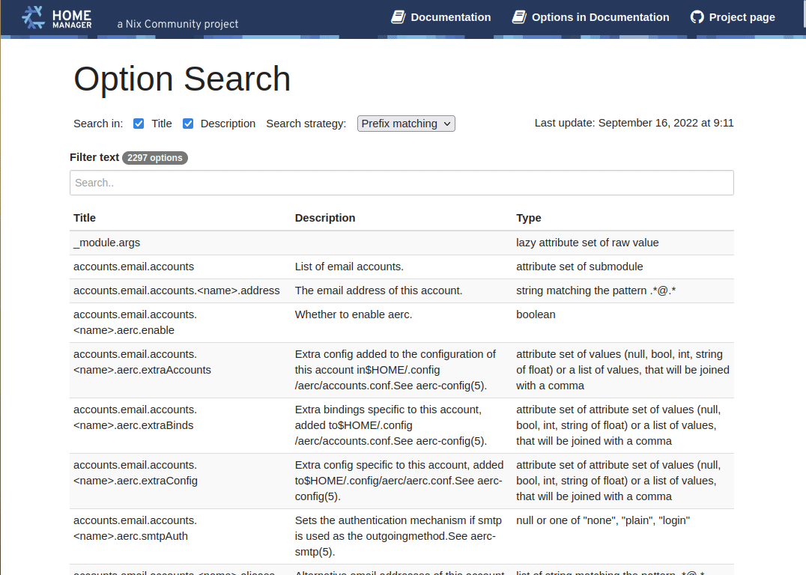

# Home Manager Options Search

## Home Manager Options Search has moved

The new location is <a href="https://home-manager-options.extranix.com/">HOME-MANAGER-OPTIONS.EXTRANIX.COM</a>

## Please update your bookmarks

Find [home manager](https://github.com/nix-community/home-manager) options quickly.




## Maintainers Notes

After a new NixOS and Home Manager release, update the release info in the Hugo
config:

Edit `config.yaml`, and update the following...

```yaml
params:
  release_current_stable: release-24.11
  releases:
    - name: unstable
      value: master
    - name: 24.11 (stable)
      value: release-24.11
    - name: 24.05
      value: release-24.05
    - name: 23.11
      value: release-23.11
    - name: 23.05
      value: release-23.05
    - name: 22.11
      value: release-22.11
```

This file is used by ./scripts/build_and_parse_hm_options.rb and by Hugo when
generating a new website version.


## Contribute

- Please use the issue tracker or fork this site for PR's

## Credits

- Powered by the [Nix Community](https://nix-community.org/)
- [JS Search](https://github.com/bvaughn/js-search), efficient, client-side search library for JavaScript and JSON objects
- Header inspired by the [DocDock](https://docdock.vjeantet.fr/) Hugo Theme.
